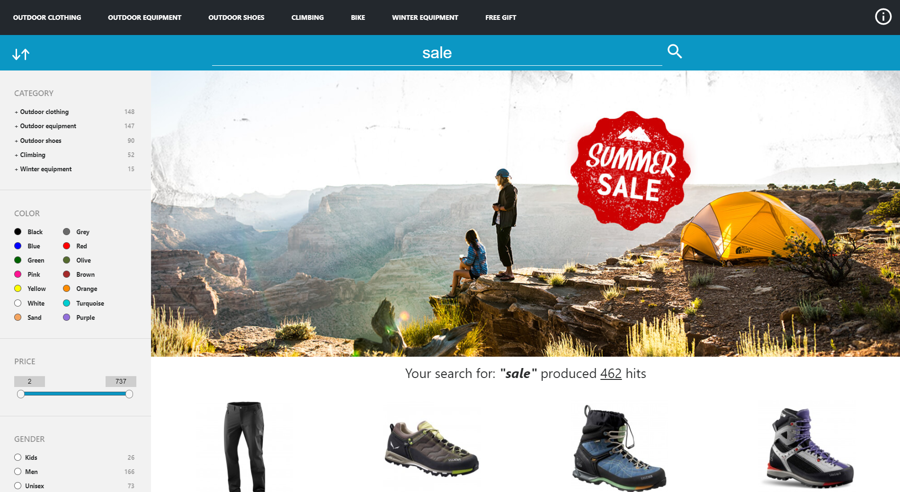

This module includes 'ff-campaign-feedback', 'ff-campaign-advisor' and 'ff-campaign-redirect'

## Advisor campaign example
Advisor campaigns help the user to navigate through the search result with some questions about the search topics



## Feedbackcampaign example
You can add ff-campaign-feedbacktext anywhere in the document. Just set the [label] attribute to an appropriate value. This value has to match a configured label value inside the FACT-Finder backend.

```html
<ff-campaign-feedbacktext label="above products">
    {{text}}
    <!--or mixed content-->
    <!--<div>{{text}}</div>-->
</ff-campaign-feedbacktext>
```

## Redirect campaign example
As soon as a configured Redirect campaign matches the criteria of the last request, this element will redirect to the destination URL of the matching campaign.

```html
<!DOCTYPE html>
<html lang="en">
    <head>
        ...
    </head>
    <body>
        <ff-campaign-redirect></ff-campaign-redirect>
        ...
    </body>
</html>
```