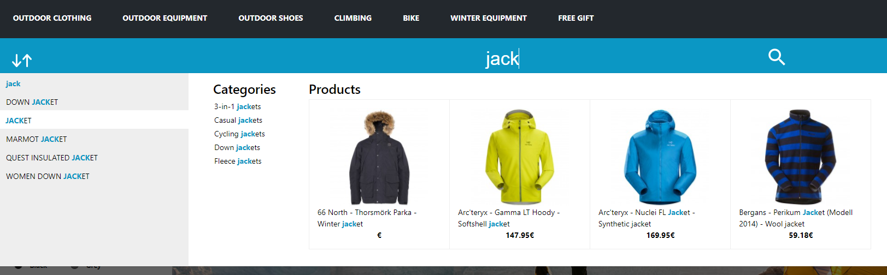

The Suggest module enables you to provide customers with suggested search terms while they are entering a search term. In this way, users do not necessarily have to enter the entire search term themselves, but can choose a suggestion. As they are presented with similar search queries, this enables them to select a suitable, more precise search term and save time when searching.

The Suggest entries are provided by the product information in the Search database as well as from the recent frequently searched and found search terms. The suggestions in this database are no longer linked to the data in the product database, which is why filtering by attributes (such as category) is unfortunately not possible by default.

Additional information can be displayed for users as well as the search suggestion itself. For instance, the origin and the description of the suggestion (for example, category, search term), the expected number of hits and a preview image can be displayed. Preview images need to be activated in the Management Interface if they are to be displayed.

The hits are normally taken from the search log files, which is why they may differ from the actual number of hits. Another disadvantage is that not all entries have hits, only those which have been searched for in the past. If the exact number of hits needs to be determined, this must be activated in the Management Interface. Note that doing this also impacts the performance of the Suggest import process significantly.

