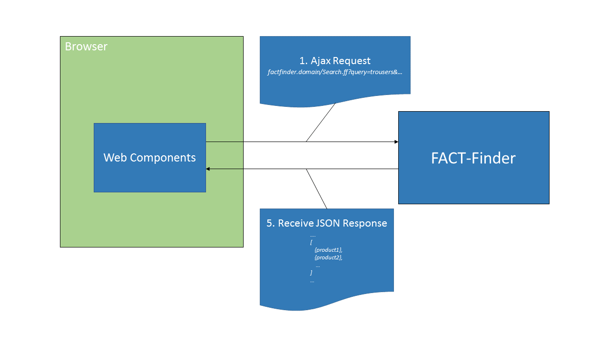
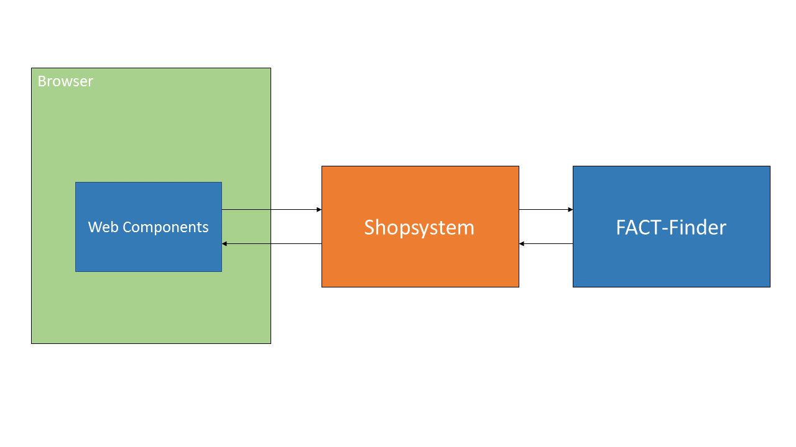

By default Web Components are communicating directly with FACT-Finder. This is configured in 
the `ff-communication` element.

All actions and requests are performed automatically for you depending on the element was
clicked. This means for example if the user clicked a `ff-asn-group-element` a filter
action is executed. FACT-Finder Web Components are basically data driven. They expect a service
which is capable of understanding the FACT-Finder API invocations and to retrieve the data like
FACT-Finder would retrieve it. See the following image:



## Change the Communication Flow
In some situations you don't want FACT-Finder Web Components to communicate directly with FACT-Finder.
 Enriching the product data with the latest stock might be one of these use cases.
    
In such a case you need to take care about some simple but important things. 
You can configure our Web Components to communicate with your shop backend by changing the `[url]` attribute 
on `<ff-communication>` element.
    
Please see the following image for an rough overview of communication:


### Detailed Overview of Communication
The following image illustrates the 5 steps to enrich search response with latest data from 3rd party services.
 Steps marked in __orange__ are meant to be performed by the shop.
 Steps in __blue__ are meant to be performed automatically by Web Components.

 
       
#### 1. Ajax Request
When the user interacts with the search result page a Ajax Request is made at certain points. This Ajax Requests needs 
now to be made to the shop system now. Change the url settings in `ff-communication` element.

```html
<ff-communication url="http://your.factfinder.com/FACT-Finder">
</ff-communication>

<!-- Change the URL accordingly -->
<ff-communication url="http://your.shop-endpoint.com/FACT-Finder-Endpoint">
</ff-communication>
```


#### 2. Forward the HTTP Request to FACT-Finder
The request made by Web Components will look something like: 

    `http://domain.com/FACT-Finder/Search.ff?query=shoe&channel=shoeshop_en`.

The URL will always follow this pattern:
 
    `[protocol]://[domain + port]/[APP-Name]/[API-Name].ff?[HTTP-Params]`
    
So basically all you need to do is strip everything before the API-Name away and replace it by the
    original FACT-Finder URL. Taking the URLs from Step 1. one the url changes would like:

    `http://your.shop-endpoint.com/FACT-Finder-Endpoint/Search.ff?query=shoe&channel=shoeshop_en`
    `http://your.factfinder.com/FACT-Finder/Search.ff?query=shoe&channel=shoeshop_en`
#### 3. Receive JSON Respone
Now you just need to make the HTTP GET request and receive the data.

#### 4. Enrich JSON Response with additional data
Lets say you want to add latest stock to your received records. Lets consider the following
    response:
```html
{
  "searchResult": {
    "records": [
      {
        "foundWords": [],
        "id": "f2d296767b851bcf56074343a1a805a9",
        "keywords": [],
        "position": 1,
        "record": {
          "title": "Shoe A",
          "price": 999.90,
          "...": "..."
        },
        "searchSimilarity": 96.16,
        "simiMalusAdd": 0
      }
    ]
  }
}
```

The `record` property is the correct place to add the product specific data. Just get the
    stock data wherever you want to get it from and add it to the json response. The result would like:
```
{
  "records": [
    {
      "foundWords": [],
      "id": "f2d296767b851bcf56074343a1a805a9",
      "keywords": [],
      "position": 1,
      "record": {
        "title": "Shoe A",
        "price": 999.90,
        "STOCK": 19,
      },
      "searchSimilarity": 96.16,
      "simiMalusAdd": 0
    }
  ]
}
```

#### 5. Return Data to Web Components
You are done with manipulating the JSON response. Just send the data back and take advantage of your enriched search response.